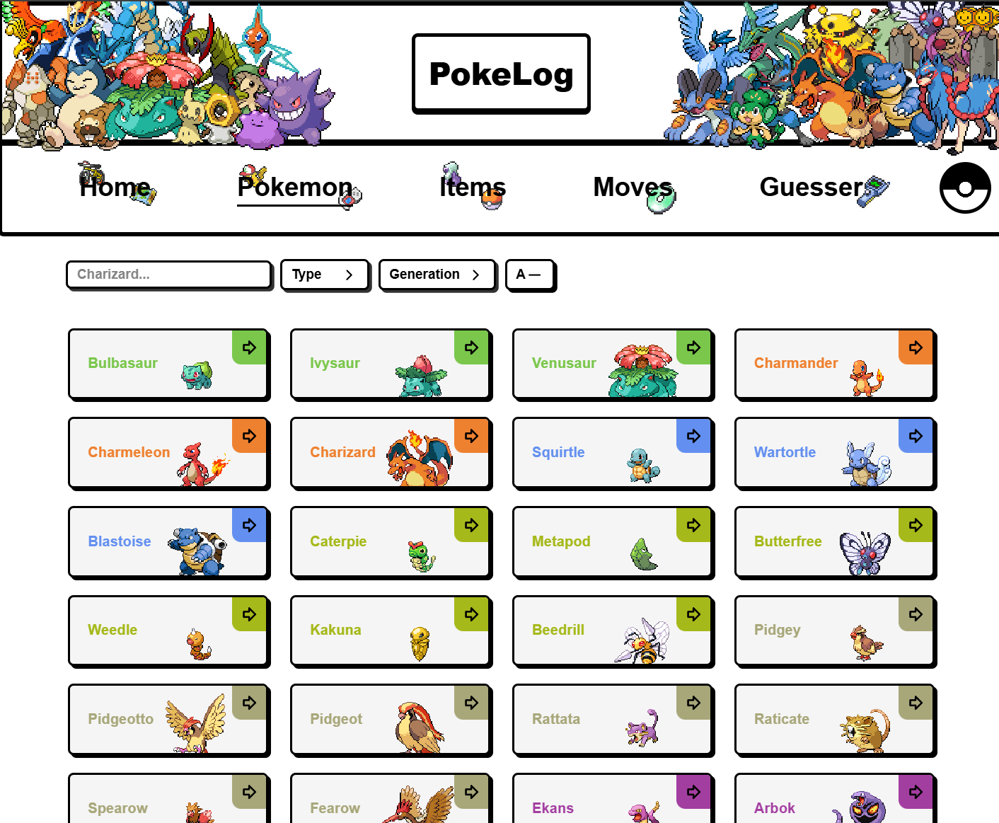
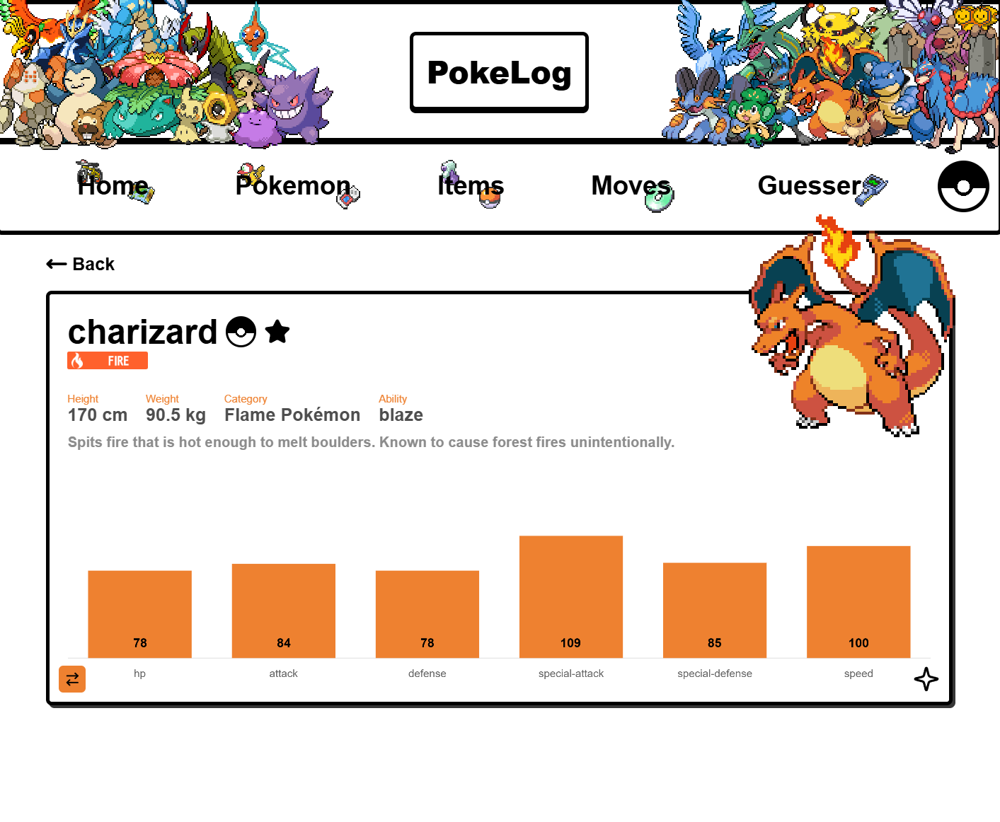
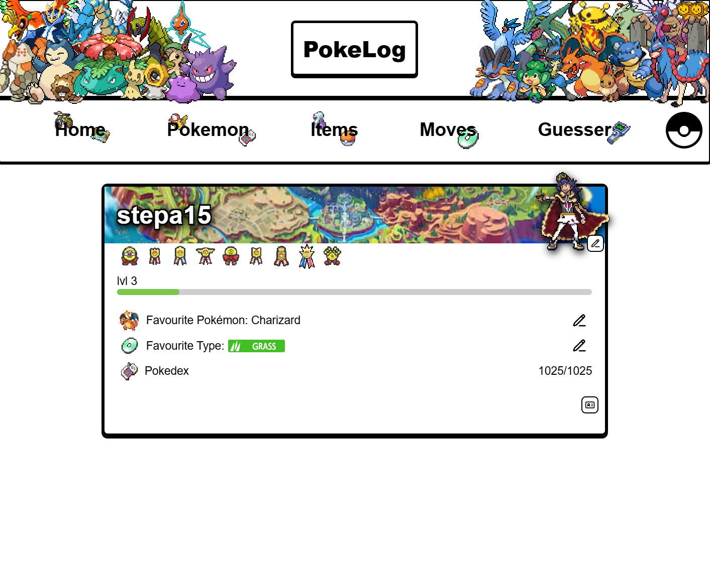
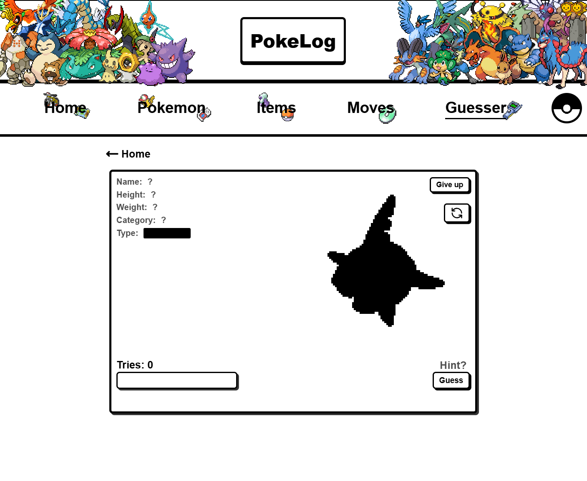

# Pokélog

**Pokélog** is a fan-made Pokémon web app designed for trainers, collectors, and fans! Dive into detailed Pokémon data, test your knowledge, track your progress, and showcase your journey with a customizable trainer card.

> ⚠️ This is a fan project and is not affiliated with Nintendo, Game Freak, or The Pokémon Company.

---

## 🌟 Features

- 🔎 **Browse & Filter Pokémon**
  - Full Pokédex list of all generations
  - Filter by type or generation, sort by number or name or simply search.
  
- 📄 **Detailed Pokémon Pages**
  - Stats, types, evolutions, abilities, base experience, height, weight, and more
  - **Toggle between default and shiny sprites with one click**

- 🎒 **Items & Moves**
  - Browse and search through in-game items and moves with descriptions and effects

- ❓ **Guess The Pokémon Game**
  - Fun quiz mode where you guess Pokémon silhouettes or descriptions

- 🧑‍🎓 **User Profile**
  - Customize your profile with:
    - Favorite Pokémon
    - Favorite type and trainer
    - Custom card backgrounds
    - Badge collection
    - Your personal Pokédex

- 📘 **Trainer Card Export**
  - Generate and export a personalized trainer card to share with friends

---

## 🚀 Getting Started

### Prerequisites

- Node.js (v18+ recommended)
- npm or yarn
- [Clerk](https://clerk.dev/) account if you're using Clerk for auth

### Installation
```bash
git clone https://github.com/StepanBlaha/Pokedex-project
cd Pokedex-project
```
#### Setup backend
```
cd backend 
npm install
# or
yarn install
```
#### Setup frontend
```
cd frontend 
npm install
# or
yarn install
```

## 🛠️ Tech Stack
- React
- Typescript
- Clerk (Authentication & User Management)
- React Router
- CSS Modules
- Chart.js
- MongoDB

## Deployment


# 📸 Screenshots
<details> <summary>Click to expand</summary>
📱 Pokédex list page
  <br>
📘 Pokémon details page
  <br>
🧑 Trainer profile with badge progress
  <br>
🎮 Guess the Pokémon minigame
  <br>
</details>

## 🙌 Contributing
Contributions are welcome! Feel free to fork this project and submit a pull request.
To contribute:

- Fork the repo
- Create your branch: git checkout -b feature/your-feature-name
- ommit your changes: git commit -m "Add your feature"
- Push to the branch: git push origin feature/your-feature-name
- Open a pull request

## 📜 License
This project is open-source and available under the MIT License. See `LICENSE.txt` for more information. 
